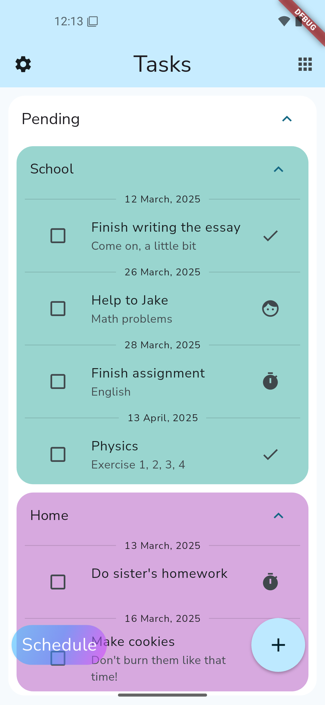
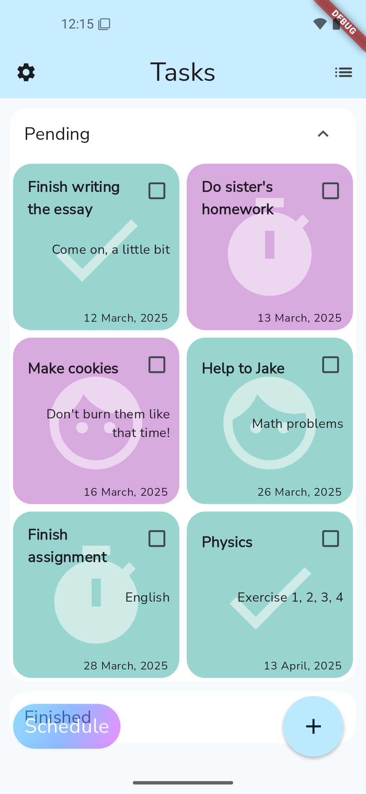
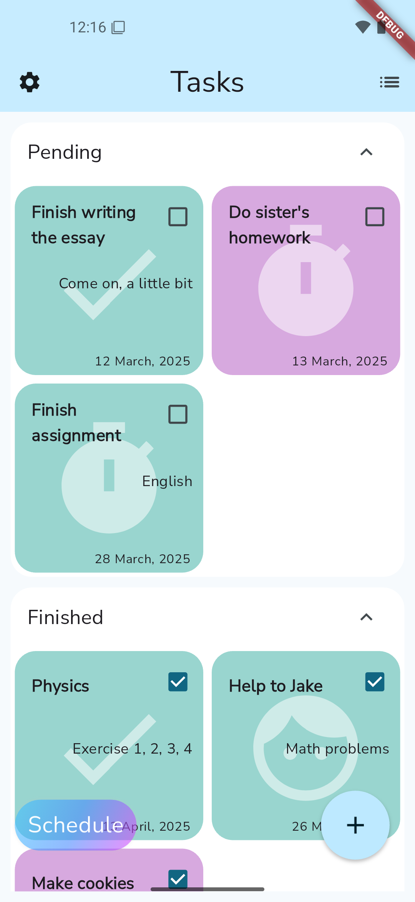
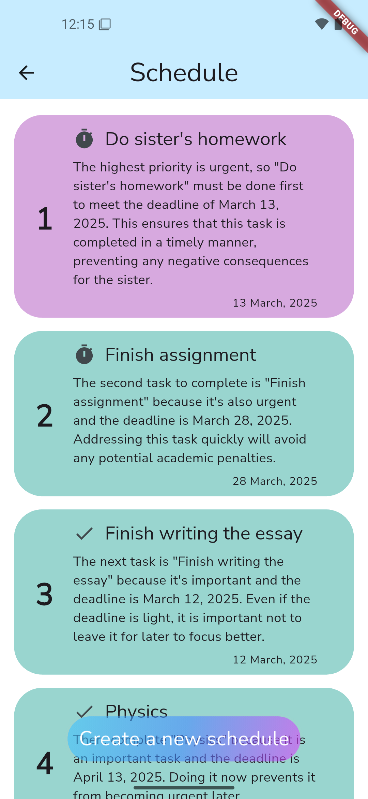
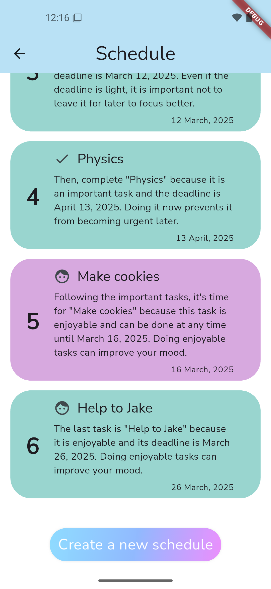
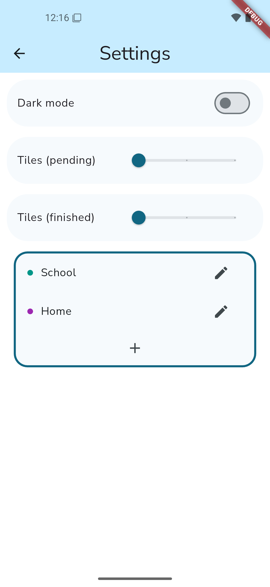
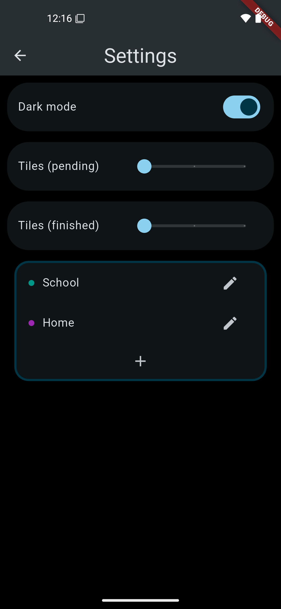
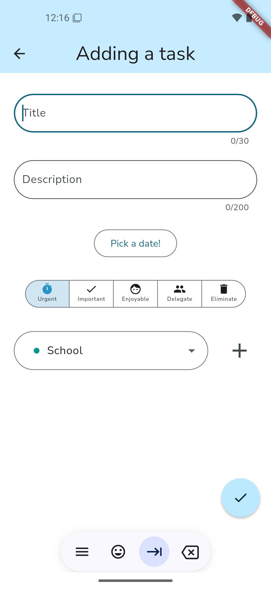
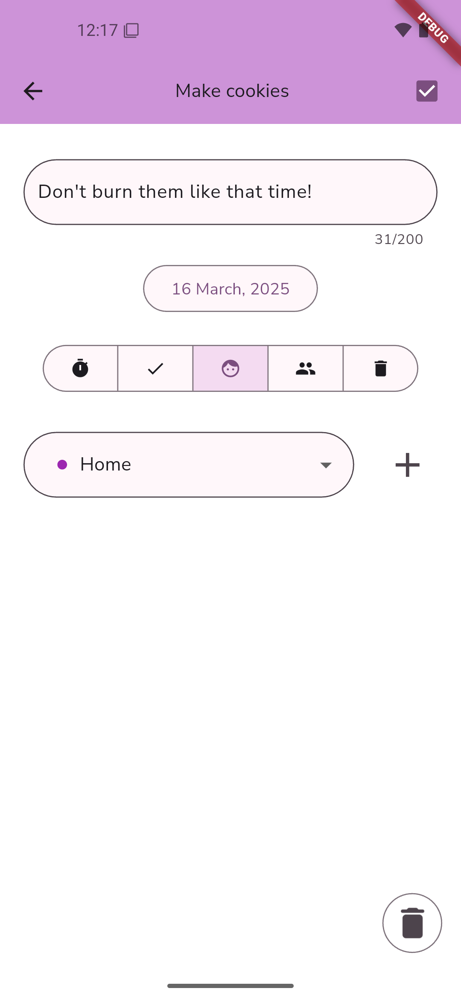

# AI-Powered Task Manager

This is a task manager featuring an AI-powered smart scheduler. I developed this app to master my Dart and Flutter skills while creating a fully functional mobile application.

### Features

- AI-generated task schedules with priority and descriptions (powered by Gemini).
- Light and dark mode support.
- Task creation and management.
- Customizable settings.

### AI Integration & Future Plans

Due to the extra fees associated with Gemini API usage, I cannot currently afford to publish the AI-powered version of the app on Google Play or the App Store. However, I plan to release it in the future.

### Screenshots

You can find screenshots of the app in the file "TaskManager_Screenshots.pdf". It includes:

- The home screen with tasks.
- An AI-generated schedule.
- Task details and settings.
- Dark mode in action.

